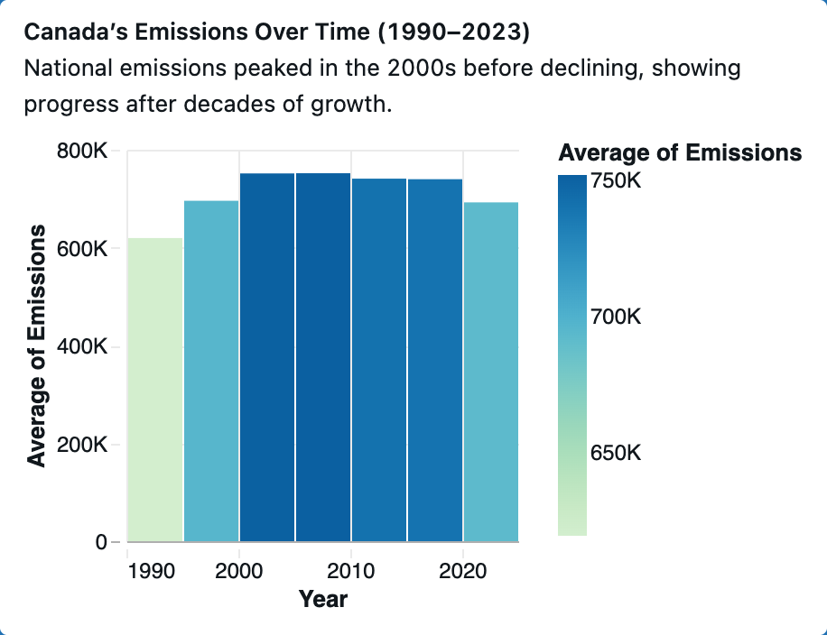
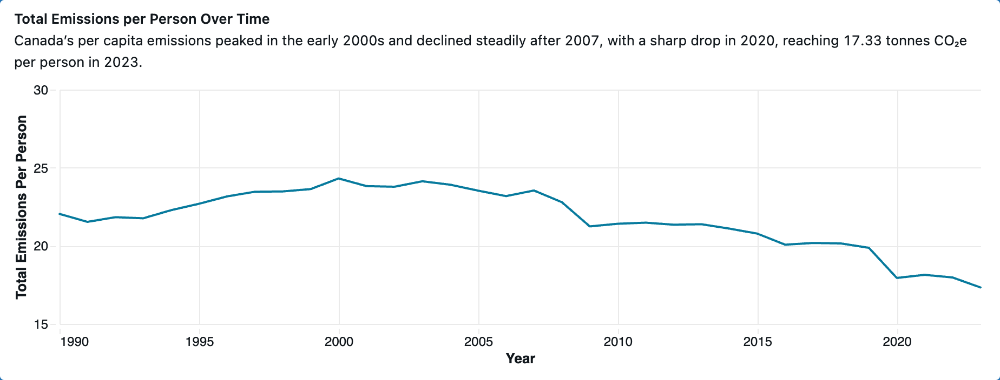
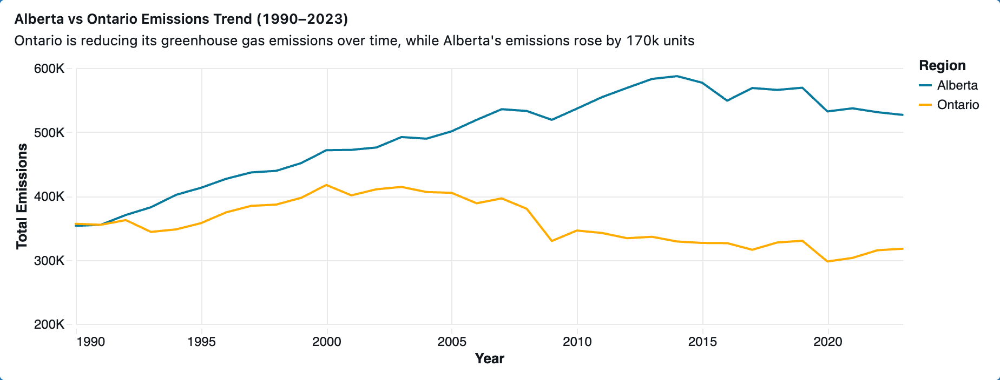
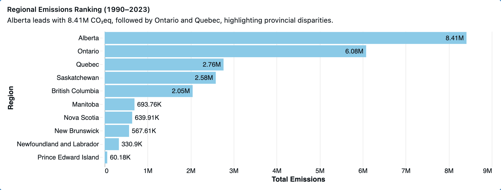
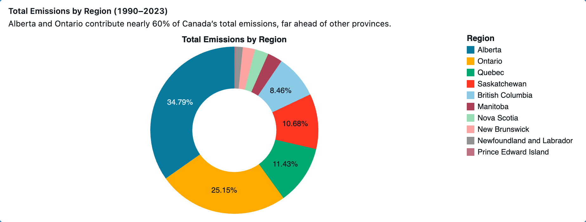
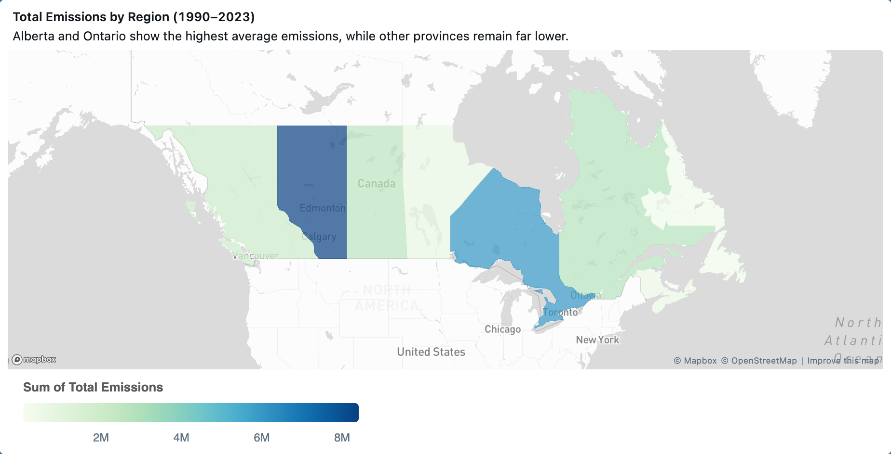
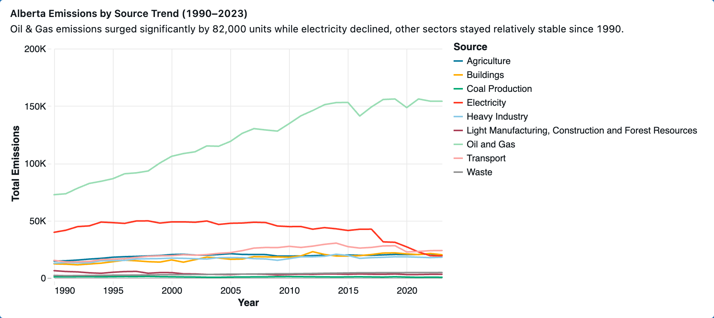

# Canada Emissions Dashboard

## Overview
This project is an end-to-end **Databricks dashboard** analyzing greenhouse gas (GHG) emissions in Canada from 1990–2023. It is to test and showcase advanced SQL, visualization, and analytics skills.

## 📊 Data Source
- **Environment and Climate Change Canada (ECCC)** – National Inventory Report datasets  
  [EN_GHG_Econ_Can_Prov_Terr.csv](https://data-donnees.az.ec.gc.ca/data/substances/monitor/canada-s-official-greenhouse-gas-inventory/B-Economic-Sector/EN_GHG_Econ_Can_Prov_Terr.csv)  
- Dataset covers greenhouse gas emissions by **region** and **sector** from **1990–2023**, reported in kilotonnes (kt CO₂e).

## Features
- **Regional Analysis**: Compare provinces such as Alberta, Ontario, Quebec, Saskatchewan, British Columbia, Manitoba, Nova Scotia, New Brunswick, Newfoundland and Labrador, Prince Edward Island
- **Sectoral Breakdown**: Oil & Gas, Transport, Buildings, Electricity, Agriculture, Heavy Industry, Waste, Light Manufacturing, Construction and Forest Resources, and Coal Production
- **Trend Visualizations**: Line charts, bar charts, pie charts, heatmaps, histograms, and choropleth maps
- **Key Insights**:
  - Alberta and Ontario contribute nearly 60% of Canada’s total emissions
  - Oil & Gas and Transport together account for more than half of emissions
  - Alberta’s emissions rose by ~170K units since 1990, driven by oil & gas (+82K units)
  - Ontario’s emissions declined sharply after its coal phase-out
  - National emissions peaked around 2008, dropped in 2009 (financial crisis), and again in 2020 (COVID-19)

## Repository Structure

```
canada-emissions-dashboard/
│
├── README.md
├── schema.md
├── data_description.md
├── queries.sql
├── visuals/
│   ├── alberta_emissions_by_source_trend.png
│   ├── alberta_vs_ontario_emissions_trend.png
│   ├── canada_total_emissions_trend.png
│   ├── canada_emissions_decade_bars.png
│   ├── canada_per_capita_emissions_trend.png
│   ├── emissions_by_source_donut.png
│   ├── emissions_by_region_donut.png
│   ├── emissions_by_region_bar.png
│   ├── emissions_by_region_map.png
│   └── emissions_by_source_heatmap.png
├── notebooks/
│   └── emissions_analysis.ipynb
└── LICENSE


```

## 📊 Visuals

### 1. Canada’s Total Emissions Trend (1990–2023)  
*Emissions climbed until 2008, then fluctuated, with sharp drops in 2009 and 2020.*  


### 2. Canada’s Emissions Over Time (Decade Averages)  
*National emissions peaked in the 2000s before declining, showing progress after decades of growth.*  


### 3. Canada’s Per Capita Emissions Trend (1990–2023)  
*Canada’s per capita emissions peaked in the early 2000s and declined steadily after 2007, reaching 17.33 tonnes CO₂e per person in 2023.*  


---

### 4. Alberta vs Ontario Emissions Trend (1990–2023)  
*Alberta’s emissions rose by ~170K kt CO₂eq, while Ontario reduced sharply after its coal phase‑out.*  


### 5. Regional Emissions Ranking (1990–2023)  
*Alberta leads with 8.41M kt CO₂eq, followed by Ontario and Quebec, highlighting provincial disparities.*  


### 6. Total Emissions by Region (1990–2023)  
*Alberta and Ontario contribute nearly 60% of Canada’s total emissions.*  


### 7. Total Emissions by Region (Map View)  
*Alberta and Ontario show the highest average emissions, while other provinces remain far lower.*  


---

### 8. Alberta Emissions by Source Trend (1990–2023)  
*Oil & Gas emissions surged by 82K kt CO₂eq, while electricity declined and other sectors remained stable.*  


### 9. Total Emissions by Source (Canada)  
*Oil & Gas and Transport together account for more than half of Canada’s greenhouse gas emissions.*  


### 10. Greenhouse Gas Emissions by Source Over Time  
*Oil & Gas and Transport dominate consistently, while electricity emissions decline after 2005.*  


## How to Reproduce
1. Clone the repository:
   ```bash
   git clone https://github.com/yourusername/canada-emissions-dashboard.git

*(More visuals available in the `visuals/` folder)*

## How to Reproduce
1. Clone the repository:
   ```bash
   git clone https://github.com/maryam-v/canada_emissions_dashboard.git
   
2. Import SQL queries into Databricks.

3. Connect to the ECCC dataset.

4. Run queries and generate dashboards.

5. Explore visualizations in the visuals/ folder.

## Related Project
US Emissions Dashboard 

## License
This project is licensed under the MIT License. See LICENSE for details.
